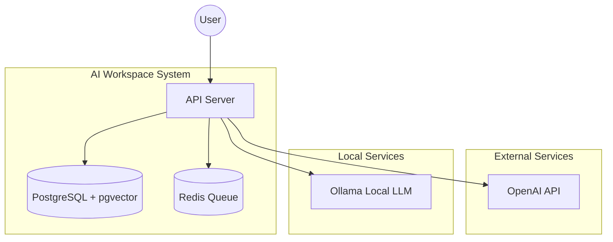
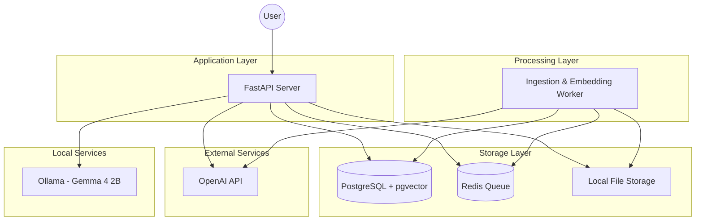
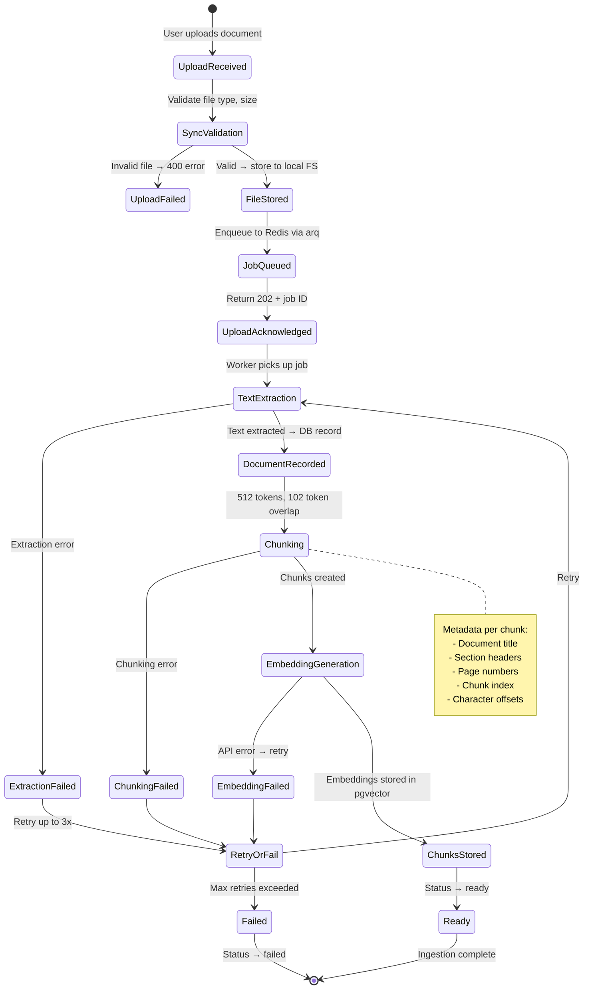
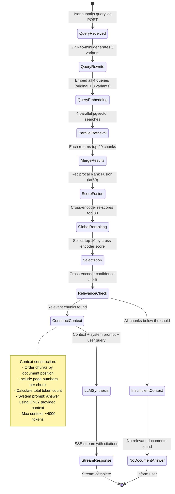

# System Overview

## System Purpose

The AI Research Workspace is a document-centric retrieval-augmented generation (RAG) system that enables users to:

- Upload PDFs and text documents
- Semantically search through document content
- Ask contextual questions about documents
- Receive grounded answers with citations
- Build a searchable knowledge memory

The system is designed as a **retrieval and knowledge processing system**, not a chatbot wrapper. The primary focus is on retrieval quality, chunking quality, observability, ranking correctness, context construction, and traceable retrieval.

## Phase 1 Scope

Phase 1 focuses exclusively on document-centric RAG fundamentals:

**Included:**
- PDF and text document ingestion
- Text extraction from documents
- Chunking with overlap strategies (recursive character splitting)
- Embedding generation (OpenAI `text-embedding-3-small`, 1536 dimensions) and storage
- Vector similarity search (pgvector HNSW, cosine distance)
- Query rewriting and multi-query generation (original + 3 variants)
- Reciprocal Rank Fusion (RRF) for multi-query score merging
- Global reranking with cross-encoder (`ms-marco-MiniLM-L-6-v2`)
- Context construction with citations and token budget management
- LLM-based answer generation with grounding constraints
- Streaming responses via Server-Sent Events (SSE)
- Basic API key authentication

**Explicitly Excluded (Future Phases):**
- OCR for scanned documents
- Video processing
- Image/screenshot analysis
- Audio pipelines
- Multimodal ingestion
- Graph-based knowledge systems
- Autonomous agents
- Recursive retrieval loops
- Hybrid search (BM25 + vector)
- Semantic chunking
- User management and RBAC

## System Context (C4 Level 1)



**External Entities:**
- **User**: Interacts with the system via REST API or UI
- **OpenAI API**: Provides GPT-4o-mini for query rewriting and answer generation; provides `text-embedding-3-small` (1536d) for embedding generation
- **Ollama**: Locally-hosted LLM server running Gemma 4 2B as an alternative LLM for privacy and cost control. Runs on `localhost:11434`. Data never leaves the user's infrastructure. See ADR-013.

> **Note**: Ollama provides true local/private execution. When using Ollama with Gemma 4 2B, no data leaves the user's infrastructure. This fulfills the privacy requirement. See ADR-013.

## Container View (C4 Level 2)



**Containers:**
- **FastAPI Server**: Handles HTTP requests; orchestrates query pipeline synchronously (query rewriting → retrieval → reranking → synthesis)
- **Ingestion & Embedding Worker**: Single worker process handling document processing end-to-end: text extraction → chunking → embedding generation → storage. Uses `arq` (async Redis queue) for job management
- **PostgreSQL + pgvector**: Stores documents, chunks, embeddings (HNSW index), and ingestion state
- **Redis**: Manages background job queues via `arq`; also used for SSE message coordination
- **Local File Storage**: Stores uploaded document files on local filesystem (`./storage/documents/`)

> **Design Decision**: A single worker process handles both ingestion and embedding to simplify deployment. Chunks are embedded immediately after creation within the same job, avoiding inter-worker coordination. This can be split into separate workers if bottlenecks emerge.

## Component View (C4 Level 3)

### FastAPI Server Components
- **Document Upload API** (`POST /api/v1/documents`): Validates and accepts document uploads, returns job ID
- **Document Status API** (`GET /api/v1/documents/{id}/status`): Returns ingestion status
- **Document List API** (`GET /api/v1/documents`): Lists uploaded documents with status
- **Query API** (`POST /api/v1/query`): Accepts user queries, orchestrates retrieval pipeline, returns SSE stream
- **Health API** (`GET /api/v1/health`): Health check and dependency status
- **Query Orchestrator**: Coordinates query rewriting → parallel retrieval → score fusion → reranking → context construction → LLM synthesis

### Ingestion Worker Components
- **File Validator**: Validates file type (PDF, TXT), size (max 50MB), and integrity
- **Text Extractor**: Extracts text from PDFs using `PyMuPDF` (fitz); reads plain text from TXT files
- **Chunker**: Splits text into chunks of 512 tokens with 20% (102 token) overlap using recursive character text splitting
- **Metadata Enricher**: Annotates each chunk with document title, section headers (if detectable), page numbers, chunk index, and character offsets
- **Embedding Generator**: Creates 1536-dimensional vector embeddings using OpenAI `text-embedding-3-small`
- **Vector Indexer**: Stores embeddings in pgvector with HNSW index (m=16, ef_construction=64)

### Query Pipeline Components
- **Query Rewriter**: Uses GPT-4o-mini to generate 3 semantically diverse query variants from the original query
- **Vector Searcher**: Performs cosine similarity search against pgvector HNSW index; retrieves top-k results per query variant
- **Score Fusioner**: Merges results from multiple queries using Reciprocal Rank Fusion (RRF) with k=60
- **Cross-Encoder Reranker**: Re-scores candidate chunks using `cross-encoder/ms-marco-MiniLM-L-6-v2` (hosted in-process via `sentence-transformers`)
- **Context Constructor**: Selects top chunks within token budget, orders by document position, adds citation metadata
- **LLM Synthesizer**: Generates answer with citations using selected LLM model, streams via SSE

## API Interface Summary

| Method | Endpoint | Description | Auth |
|--------|----------|-------------|------|
| `POST` | `/api/v1/documents` | Upload document (multipart/form-data) | API Key |
| `GET` | `/api/v1/documents` | List documents with status | API Key |
| `GET` | `/api/v1/documents/{id}/status` | Get ingestion status | API Key |
| `POST` | `/api/v1/query` | Submit query (returns SSE stream) | API Key |
| `GET` | `/api/v1/health` | Health check | None |

> Full API contracts are defined in the implementation plan specifications.

## Database Schema Overview

### Core Tables

```
documents
├── id (UUID, PK)
├── filename (VARCHAR)
├── file_path (VARCHAR)
├── file_size_bytes (INTEGER)
├── mime_type (VARCHAR)
├── file_hash (VARCHAR, SHA-256)
├── status (ENUM: pending, processing, ready, failed)
├── error_message (TEXT, nullable)
├── page_count (INTEGER, nullable)
├── created_at (TIMESTAMPTZ)
└── updated_at (TIMESTAMPTZ)

chunks
├── id (UUID, PK)
├── document_id (UUID, FK → documents.id)
├── chunk_index (INTEGER)
├── content (TEXT)
├── token_count (INTEGER)
├── page_number (INTEGER)
├── section_header (VARCHAR, nullable)
├── char_start (INTEGER)
├── char_end (INTEGER)
├── embedding (VECTOR(1536))
├── created_at (TIMESTAMPTZ)
└── INDEX: HNSW on embedding (cosine, m=16, ef_construction=64)
└── INDEX: (document_id, chunk_index) UNIQUE
```

## State Machines

### Document Ingestion Flow



**States:**
- **UploadReceived**: Document uploaded, awaiting validation
- **SyncValidation**: File type and size validation (synchronous, <100ms)
- **FileStored**: File persisted to local file storage
- **JobQueued**: Processing job enqueued to Redis
- **UploadAcknowledged**: 202 Accepted returned to user with job ID
- **TextExtraction**: PDF/TXT text extraction (async worker)
- **DocumentRecorded**: Document record and text created in PostgreSQL
- **Chunking**: Text split into 512-token chunks with overlap and metadata
- **EmbeddingGeneration**: Vector embeddings created via OpenAI API (batched, up to 2048 texts per request)
- **ChunksStored**: Chunks and embeddings stored in pgvector
- **Ready**: Document fully processed and searchable
- **Failed**: Processing failed after retry exhaustion

**Failure Handling:**
- Validation failures return 400 error immediately to user
- Processing failures retry up to 3 times with exponential backoff (1s, 4s, 16s)
- Failed jobs are marked with error message and visible via status API
- Partial progress is tracked: if embedding fails, text extraction is not repeated

### Query/Retrieval Flow



**States:**
- **QueryReceived**: User query received via API
- **QueryRewrite**: GPT-4o-mini generates 3 semantically diverse query variants
- **QueryEmbedding**: All 4 queries (original + variants) embedded using `text-embedding-3-small` (same model as ingestion)
- **ParallelRetrieval**: Concurrent vector similarity search for each query embedding; each retrieves top 20 chunks
- **MergeResults**: Combine results from all 4 queries into a single candidate set
- **ScoreFusion**: Deduplicate by `(document_id, chunk_index)` and merge scores using Reciprocal Rank Fusion (RRF) with k=60
- **GlobalReranking**: Top 30 candidates re-scored using `cross-encoder/ms-marco-MiniLM-L-6-v2` with the original user query
- **SelectTopK**: Select top 10 chunks by cross-encoder confidence score
- **RelevanceCheck**: Verify that at least one chunk has cross-encoder confidence > 0.5 (calibrated threshold for ms-marco model)
- **ConstructContext**: Build prompt context: order chunks by source position, include page numbers, prepend grounding system prompt, enforce ~4000 token budget
- **LLMSynthesis**: Generate answer using selected LLM (GPT-4o-mini or Gemma 4 2B via Ollama) with structured citation format
- **StreamResponse**: Stream tokens to client via Server-Sent Events (SSE)
- **InsufficientContext**: No relevant chunks found above threshold
- **NoDocumentAnswer**: Return message indicating no relevant documents found for the query

> **Key Design Choice**: The **original user query** (not rewritten variants) is used for cross-encoder reranking and LLM synthesis. Rewritten variants are only used for retrieval diversity.

## Data Flow

### Document Ingestion Data Flow

1. User uploads document via `POST /api/v1/documents` (multipart/form-data)
2. API validates file synchronously: type (PDF, TXT), size (≤50MB), non-empty
3. File stored to local filesystem at `./storage/documents/{uuid}/{filename}`
4. Document record created in PostgreSQL with status `pending`
5. Job enqueued to Redis via `arq` with document ID
6. API returns `202 Accepted` with document ID and status URL
7. Worker picks up job, updates status to `processing`
8. Text extracted from PDF via PyMuPDF or read from TXT
9. Text split into chunks: 512 tokens, 102 token overlap, recursive character splitting
10. Metadata annotated: document title, section headers, page numbers, chunk index, char offsets
11. Embeddings generated via OpenAI API in batches (up to 2048 texts/request, 1536 dimensions)
12. Chunks and embeddings stored in pgvector via batch INSERT
13. Document status updated to `ready`

### Query Processing Data Flow

1. User submits query via `POST /api/v1/query` with model preference
2. Query sent to GPT-4o-mini for rewriting → 3 diverse variants generated
3. All 4 queries (original + 3 variants) embedded via `text-embedding-3-small`
4. 4 parallel cosine similarity searches executed against pgvector HNSW index
5. Each search retrieves top 20 chunks (80 total candidates max)
6. Results merged and deduplicated by `(document_id, chunk_index)` composite key
7. Scores fused using Reciprocal Rank Fusion (RRF, k=60)
8. Top 30 candidates by RRF score sent to cross-encoder for re-scoring
9. Cross-encoder (`ms-marco-MiniLM-L-6-v2`) scores each (query, chunk) pair
10. Top 10 chunks selected by cross-encoder confidence
11. Relevance check: if best cross-encoder score < 0.5 → insufficient context path
12. Context constructed: chunks ordered by source position, page numbers included, ~4000 token budget
13. System prompt prepended: "Answer the question using ONLY the provided context. Cite sources using [Doc: title, Page: N] format."
14. LLM generates answer with streaming (SSE)
15. Citations extracted and validated against provided context
16. Response streamed to user with inline citations

## Technology Decisions

| Component | Technology | Rationale |
|-----------|-----------|-----------|
| Backend Framework | FastAPI (Python 3.11+) | Async support, native SSE, type hints, fast development |
| Database | PostgreSQL 16 + pgvector 0.7+ | Relational + vector in single DB, simpler ops, HNSW support |
| Job Queue | Redis + `arq` | Lightweight async queue, minimal setup, retry support |
| Vector Search | pgvector HNSW (cosine) | Sufficient for 100K chunks, ANN indexing, no extra infra |
| Embedding Model | OpenAI `text-embedding-3-small` (1536d) | High quality, 8191 token limit, $0.02/1M tokens |
| Reranking Model | `cross-encoder/ms-marco-MiniLM-L-6-v2` | Well-benchmarked, runs on CPU, ~50ms per pair |
| Cloud LLM | GPT-4o-mini | Fast, cost-effective, 128K context window |
| Alternative LLM | Gemma 4 2B via Ollama (localhost:11434) | True local/private execution, zero API cost, runs on low-end machines (see ADR-013) |
| Chunking | Recursive character, 512 tokens, 20% overlap | Predictable, respects sentence boundaries better than naive fixed-size |
| Score Fusion | Reciprocal Rank Fusion (k=60) | Robust multi-query fusion, rank-based (not score-dependent) |
| Relevance Threshold | Cross-encoder confidence > 0.5 | Calibrated for ms-marco model output range [0, 1] |
| Context Budget | ~4000 tokens (≈10 chunks) | Fits within model limits with room for system prompt + answer |
| Text Extraction | PyMuPDF (fitz) | Fast, no external dependencies, good PDF support |
| Streaming | Server-Sent Events (SSE) | Simple, unidirectional, native browser support |

> **Note on embedding model**: Both ingestion and query must use the **same** embedding model (`text-embedding-3-small`). Mismatched models produce incompatible vector spaces and will yield meaningless similarity scores.

*Detailed rationale for each decision available in individual ADRs.*

## Domain Language

- **Document**: Uploaded file (PDF, TXT) with extracted text content and metadata
- **Chunk**: Segment of document text (~512 tokens) with overlap, positional metadata, and embedding
- **Embedding**: 1536-dimensional vector representation of chunk text for semantic similarity search
- **Query**: User question or search request submitted via API
- **Query Rewrite**: LLM-generated semantic variant of original query for retrieval diversity
- **Multi-Query**: Strategy of searching with multiple query variants to improve recall
- **Retrieval**: Fetching relevant chunks via approximate nearest neighbor (ANN) vector search
- **Reciprocal Rank Fusion (RRF)**: Score merging strategy that combines rankings from multiple queries using reciprocal rank positions
- **Reranking**: Re-scoring retrieved chunks using a cross-encoder model for better precision
- **Context**: Ordered set of chunks provided to LLM for answer generation, within a token budget
- **Citation**: Reference to source document title and page number in format `[Doc: title, Page: N]`
- **Cross-Encoder**: A model that takes (query, document) pairs and produces a relevance score, more accurate than bi-encoder similarity
- **HNSW**: Hierarchical Navigable Small World — the approximate nearest neighbor index algorithm used by pgvector
- **SSE**: Server-Sent Events — the streaming protocol used for real-time response delivery
- **Grounding**: Constraining LLM output to only information present in the provided context
- **Hallucination**: LLM generating content not grounded in provided context

## Non-Functional Requirements

### Performance
- **Query latency**: < 5 seconds end-to-end for typical queries (excluding LLM streaming time)
- **First token time**: < 5 seconds from query submission to first streamed token
- **Ingestion time**: < 30 seconds for a 10-page PDF (extraction + chunking + embedding)
- **Reranking latency**: < 1.5 seconds for 30 chunks on CPU (sequential inference, ~50ms per pair)
- **Concurrent queries**: Support 10+ concurrent query requests

### Reliability
- **Ingestion retries**: 3 automatic retries with exponential backoff (1s, 4s, 16s)
- **Error logging**: All failures logged with full context (document ID, stage, error, timestamp)
- **Graceful degradation**: If reranking fails, fall back to RRF-only ranking. If query rewriting fails, use original query only.
- **Idempotency**: Re-uploading the same document is safe (detected by filename + file hash)

### Security
- **API authentication**: API key-based authentication for all non-health endpoints
- **Input validation**: File type whitelist, size limits (50MB), query length limits
- **Prompt injection mitigation**: System prompt isolation, context clearly delimited
- **File storage**: Documents stored outside web-accessible paths
- **Deferred**: Full RBAC, user management, and data encryption at rest are deferred to Phase 2

### Observability
- **Ingestion tracking**: Document status queryable via API (pending → processing → ready/failed)
- **Retrieval debugging**: Log query variants, retrieved chunk IDs, similarity scores, reranking scores, final context selection
- **Latency tracking**: Measure and log each pipeline stage (rewrite, embed, retrieve, rerank, synthesize)
- **Structured logging**: JSON-formatted logs with correlation IDs per request
- **Metrics** (Phase 1 via logs, Phase 2 via Prometheus):
  - Query latency percentiles (p50, p95, p99)
  - Ingestion success/failure rate
  - Average chunks retrieved per query
  - Reranking score distribution

### Scalability
- **Document storage**: Designed for 1,000+ documents, 100K+ chunks in Phase 1
- **pgvector HNSW**: Tested performant up to ~1M vectors; beyond that, consider dedicated vector DB
- **Worker scaling**: Single worker sufficient for Phase 1; `arq` supports multiple concurrent workers if needed
- **Queue capacity**: Redis can handle burst ingestion of 100+ documents

## Evolution Path (Beyond Phase 1)

### Phase 2: Retrieval Quality & Operations
- Hybrid search (BM25 + vector with score combination)
- Metadata filtering during retrieval (by document, date range, tags)
- Semantic chunking (split by semantic boundaries instead of fixed-size)
- Chunk size tuning experiments with evaluation metrics
- Enhanced observability: Prometheus metrics, Grafana dashboards
- User management and RBAC

### Phase 3: Knowledge Management
- Knowledge relationships and semantic linking between documents
- Document versioning and content deduplication
- Advanced citation formats (highlighted snippets, link-to-source)
- User feedback loops (thumbs up/down → fine-tuning retrieval)
- Evaluation framework (RAGAS or similar) for automated quality assessment

### Future Exclusions (Intentionally Deferred)
- Video processing
- OCR for scanned documents
- Multimodal pipelines (images, audio)
- Graph-based knowledge systems
- Autonomous agents
- Recursive retrieval loops

## Key Assumptions

1. **Single-user or small-team usage** in Phase 1 — no multi-tenancy
2. **Internet connectivity required** — OpenAI API is a hard dependency for embeddings and primary LLM
3. **English-language documents only** in Phase 1
4. **PDF text is extractable** — scanned/image-based PDFs are not supported
5. **Documents are trusted** — no malicious file scanning beyond type/size validation
6. **Ollama availability** — the Ollama service must be running locally (`localhost:11434`) for the alternative LLM option. Ollama does not require internet connectivity.
